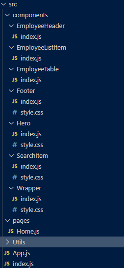
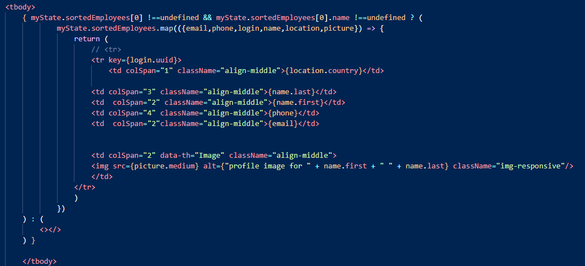

# React Employee Directory 
Corporate employee directory using `React`

#### Link to deployed app
 <https://rodolfod1.github.io/employee-dir/>
   
MIT 

## About this application:
`REACT`,  application, handling api and html deployed using `gh-pages`.

## Table of contents:
* [React Employee Directory](#React-employee-directory)
* [About](#about-this-application)
* [Usage](#usage)
* [Installation](#installation)
* [License](#license)
* [Testing](#special-testing-instructions)
* [In case of Questions](#in-case-of-questions)
* [Link to App](#Link-to-deployed-app)

# Usage:
    This  application can be used locally localhost:3000 or remotely since it is deployed on GitHub-pages `gh-pages`.
    The app makes a call to the random user API retrieving a list of 50 users/employees and display them on a table. 
    the table can be sorted out by First name , last name, email, phone number or location country. 
    Also the user can narrow they search filtering the list by last name using a search bar component. 
    

- Here it is an example on how this application works:

---
## Installation:
### For Local Deployment: 
The application requires `bootstrap`, `axios`,  node packages.
a JSON file is provided with these dependencies please Run `npm install`  before executing `npm start`

### For Remote Deployment: 
Please "click" on this link to go to the gh-pages version of this app:

<https://rodolfod1.github.io/employee-dir/>

## License
I have used the MIT license for this application see repository documentation.

<https://opensource.org/licenses/MIT>

## Testing
This can be manually tested or using any test tool

## Code Screenshots:
- src file has been broken down to these components  example  
  
- Snippet for deconstructing the API's JSON file: 

 

## In case of questions:
Please contact me at my e-mail: 
rodolfodzr@gmail.com

Follow me on Github
<https://github.com/Rodolfod1>
